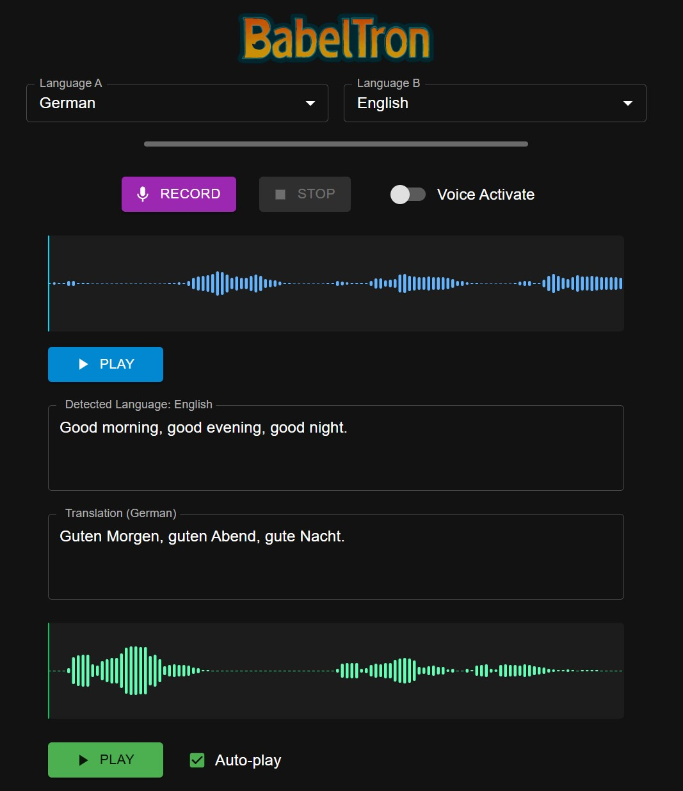
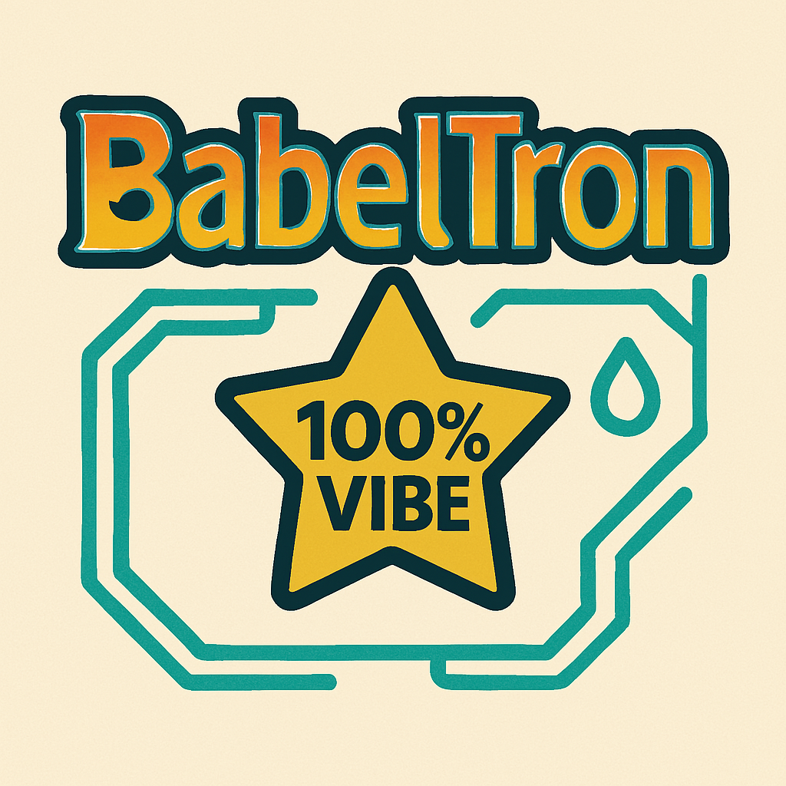

# BabelTron

[](https://github.com/sebseb7/BabelTron/actions/workflows/release.yml)

[](https://github.com/sebseb7/BabelTron)

## TODO

### Next Development Steps
- **Semantic Voice Activity Detection**: Enhance the current VAD system with semantic understanding
- **Component Refactoring**: 
  - Create comprehensive refactoring plan
  - Focus on consistency and reliability
  - Implement systematic component architecture
- **Token Counter**: Add functionality to track and display token usage


---


Voice recorder with transcription, translation, and language detection powered by OpenAI.



<div align="center">
  
  <br/>
  <em>100% vibe coded with cursor</em>
</div>

## Demo

Check out BabelTron in action:

[](https://youtu.be/Rc7W_zZJOFk)

## Features

*   Record audio from selected input device.
*   Automatic transcription using OpenAI
*   Automatic language detection.
*   Automatic translation between selected languages using OpenAI (Language A <-> Language B).
*   Text-to-Speech (TTS) synthesis of the translation using OpenAI.
*   Adjustable models for transcription and TTS.
*   Visual audio waveform display.
*   Voice Activity Detection (VAD) option for recording.
*   Basic settings management (API Key, device, models).

## BUILD

**Prerequisites:**

*   [Node.js](https://nodejs.org/) (includes npm)
*   Git

**Steps:**

1.  Clone the repository:
    ```bash
    git clone <repository-url>
    cd babeltron
    ```
2.  Install dependencies:
    ```bash
    npm install
    ```
3.  Set your OpenAI API Key in the application's settings.

## Usage

1.  **Development Mode:**
    ```bash
    npm run dev
    ```
    This will start the application with live reloading for the renderer process.

2.  **Production Build:**
    *   Build the application:
        ```bash
        npm run build:prod-no-package && electron-builder --dir
        ```
    *   The installable application will be in the `

## Contributing

Contributions are welcome! Here's how you can contribute to BabelTron:

1. **Fork the repository** on GitHub
2. **Clone your fork** to your local machine
3. **Create a branch** for your feature or bugfix (`git checkout -b feature/amazing-feature`)
4. **Make your changes** and commit them with descriptive messages
5. **Push your branch** to your fork on GitHub
6. **Open a Pull Request** from your fork to the main repository

Please follow these guidelines:
* Use descriptive commit messages following conventional commits format
* Include tests for new features
* Update documentation for any changes
* Maintain the existing code style
* Respect the 100% vibe coding requirement ✨

## License

This project is licensed under the BSD Zero Clause License (0fucksGiven) - see the [LICENSE](LICENSE) file for details.

## Acknowledgments

* OpenAI for providing the APIs that power this application
* Electron for making cross-platform desktop applications possible
* React and MUI for the user interface
* All contributors who have helped improve this project